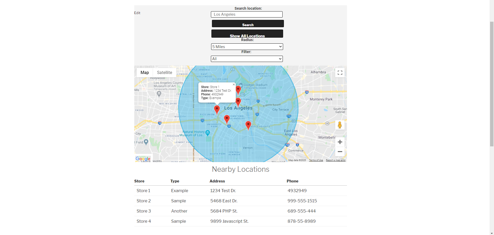
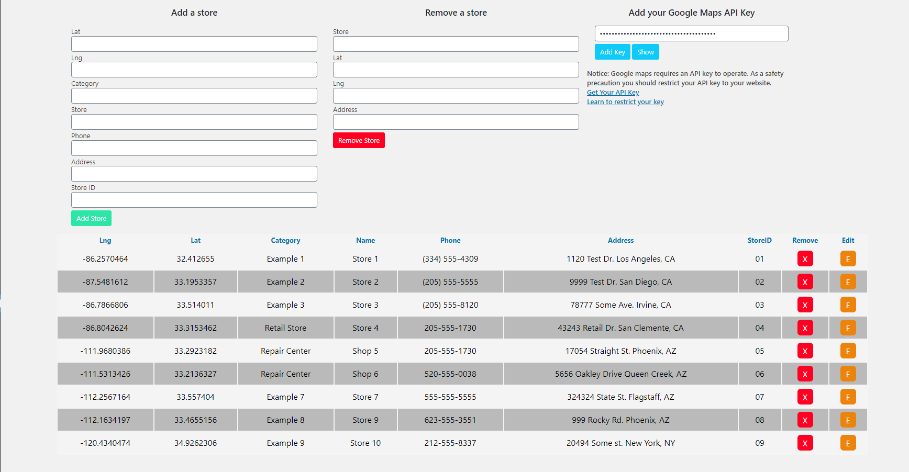
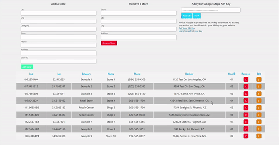

# Mepps Maps # 



## About 
Mepps Maps is a store locator plugin for Wordpress. Add as many locations as you want. Mepps Maps takes a client location and maps out the nearest locations. 
You can also add store info and filter by type of store. Since it saves coords in geojson format, Google Maps API doesn't have to repeatedly geocode each store address
which will help save costs on API calls for businesses with a high amount of locations or a high volume of site users. 

## Installation 
Just upload the zip file via the plugins page on Wordpress. That's it!

## Usage

To add the map to any page add the shortcode:
```bash
[mpsmaps]
```

To add locations you can use the admin page. You will need to provide Lat/Lng coordinates for each location. 
You can find these on Google Maps by searching a location and looking in the address bar.
Location data can now be easily updated using the editor on the admin page. 





## New in v 1.0.2
- Added update functionality to make changing store info easier
- Store ID's are now unique and cannot conflict with eachother
- Fixed bug conflict with WooCommerce
- Client side now displays distance for each store in miles
- Marker popups now close when a new one is opened
- Refactored code for performance


## Other Notes
Avoid leaving any fields blank. Use 'n/a' instead.
As a safety measure, you should restrict your api key to your domain.


### Enjoy!